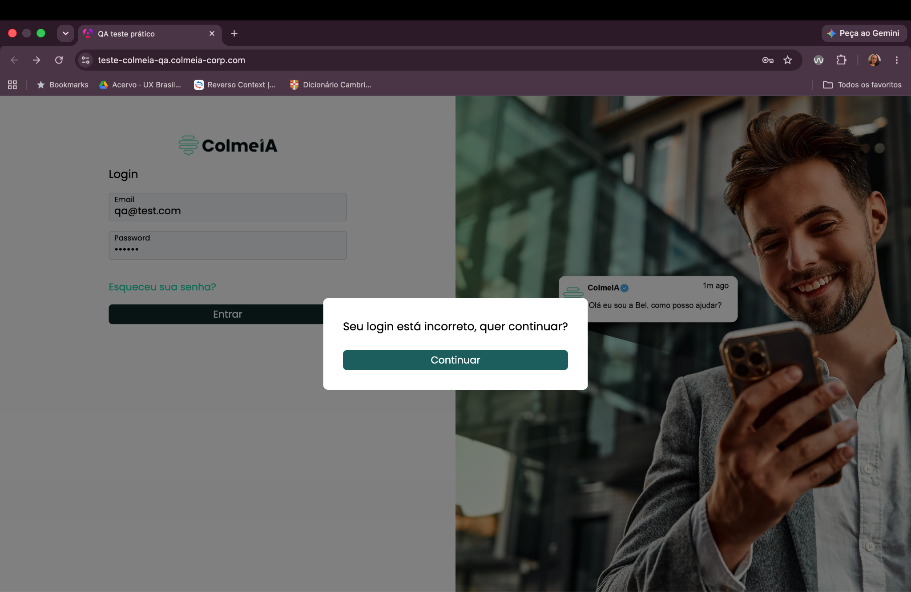
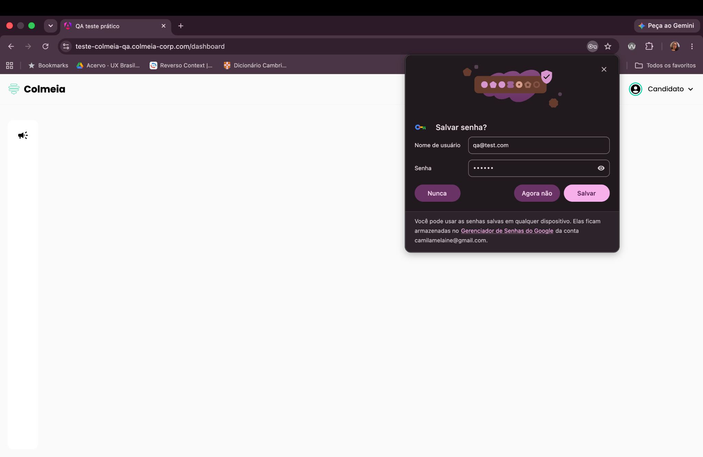

# BUG-001: Login realizado com credenciais inválidas

**Severidade:** Alta
**Ambiente:** Navegador desktop, sistema ColmeIA Forms

## Cenário
Validar o comportamento do sistema ao realizar login utilizando um e-mail e/ou senha inválidos.

## Passos para reproduzir
1. Acessar a tela de login.
2. Informar um e-mail e/ou senha inválidos.
3. Clicar em **Entrar/Login**.

## Resultado observado
O sistema permite o acesso do usuário mesmo quando um e-mail ou senha inválidos são informados, e ainda permite que a senha seja alterada.

## Resultado esperado
O sistema deve impedir o acesso e apresentar uma mensagem informando que as credenciais são inválidas.

## Evidências

