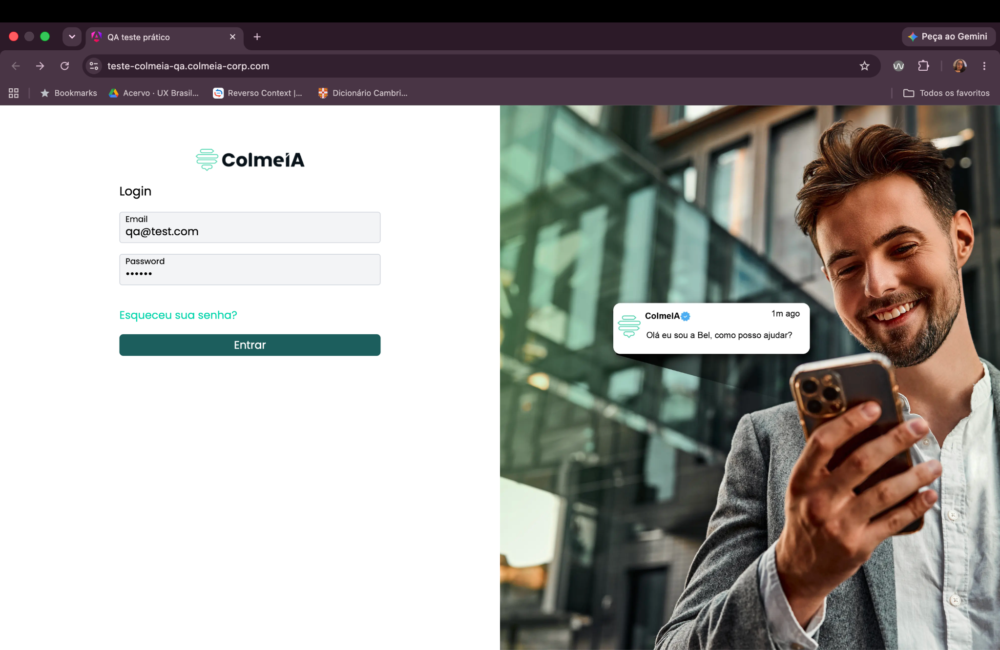

# BUG-002: Funcionalidade "Esqueceu sua senha" não responde

**Severidade:** Alta
**Ambiente:** Navegador desktop, sistema ColmeIA Forms

## Cenário
Validar o comportamento da funcionalidade "Esqueceu sua senha" na tela de login.

## Passos para reproduzir
1. Acessar a tela de login.
2. Informar um e-mail/senha válidos.
3. Clicar em **"Esqueceu sua senha"**.

## Resultado observado
Ao clicar em "Esqueceu sua senha", nenhuma ação ocorre na tela.

## Resultado esperado
O sistema deve abrir uma nova janela ou pop-up para que o usuário redefina sua senha.

## Evidências

