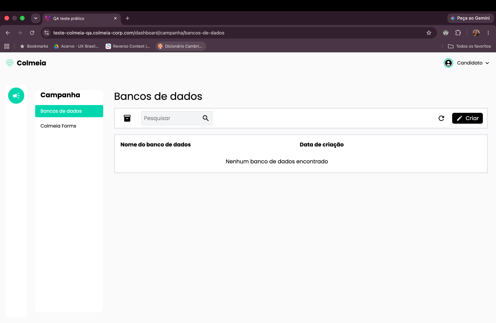
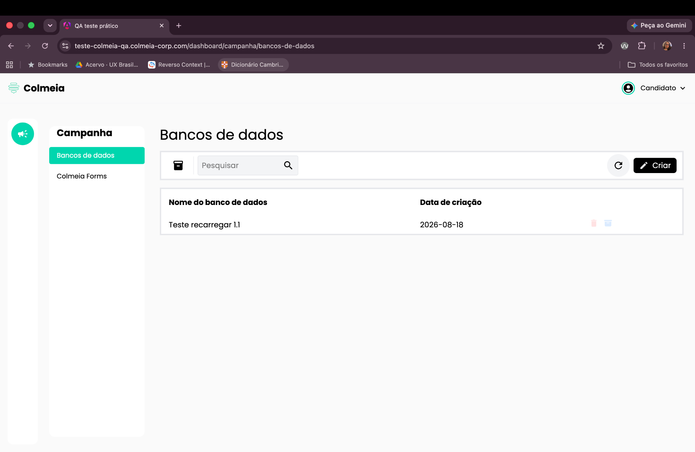

# BUG-003: Itens somem ao clicar no ícone de recarregar

**Severidade:** Média
**Ambiente:** Navegador desktop, tela Banco de Dados

## Cenário
Validar o comportamento do ícone de recarregar na tela de Banco de Dados.

## Passos para reproduzir
1. Fazer login no sistema.
2. Na página inicial, clicar em **"Banco de Dados"** (com itens previamente cadastrados).
3. Clicar no ícone de recarregar.

## Resultado observado
Ao clicar no ícone de recarregar, os itens que estavam listados no banco de dados somem da página.

## Resultado esperado
Ao clicar no ícone de recarregar, os itens devem apenas ser atualizados e permanecer visíveis na listagem.

## Evidências

