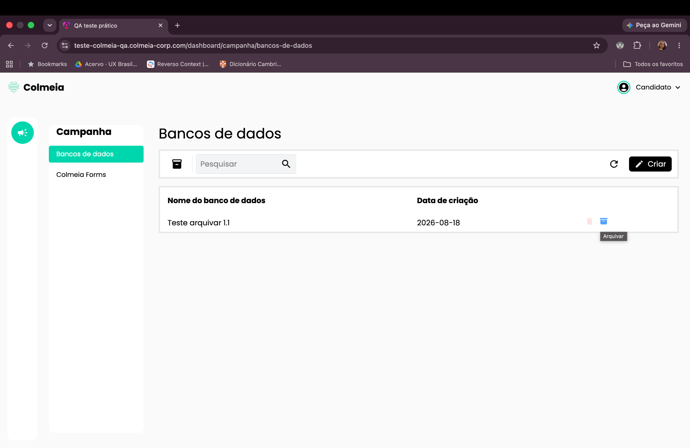
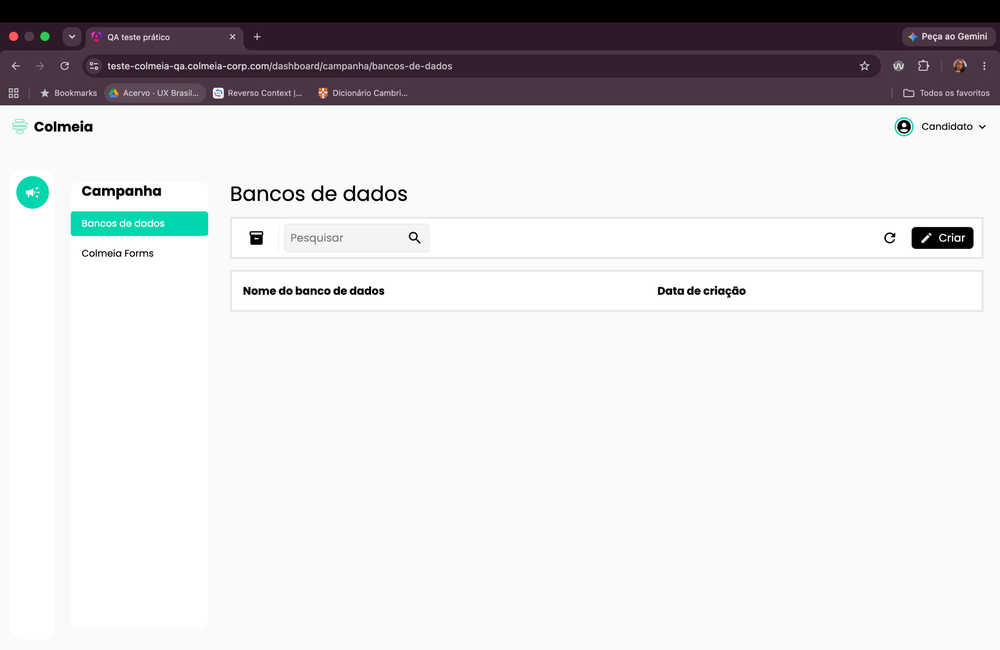
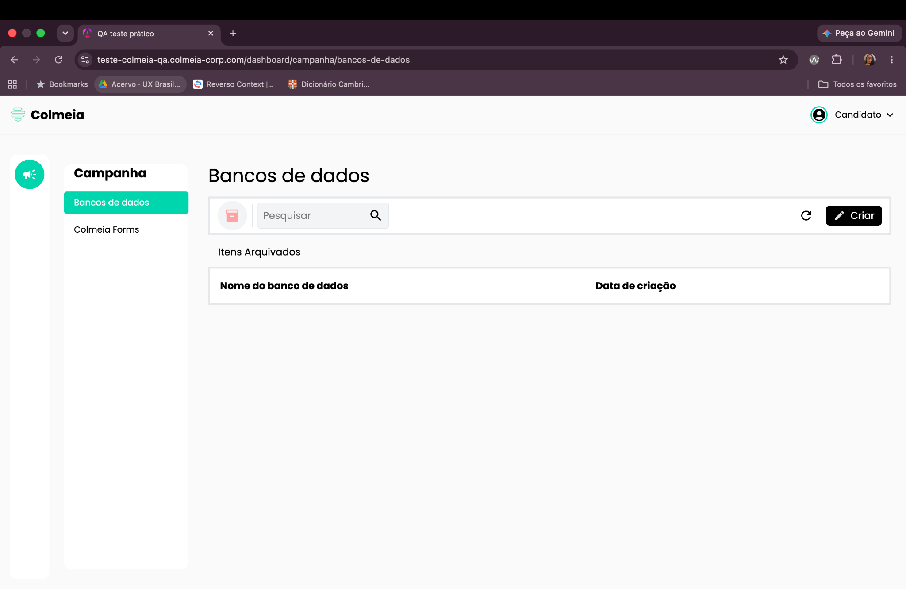

# BUG-004: Itens arquivados não são exibidos na aba de arquivados

**Severidade:** Alta
**Ambiente:** Navegador desktop, tela Banco de Dados

## Cenário
Validar a visualização de itens arquivados.

## Passos para reproduzir
1. Fazer login no sistema.
2. Na página inicial, clicar em **"Banco de Dados"** (com itens previamente cadastrados).
3. Selecionar um item e clicar no ícone azul de arquivar.
4. Clicar no ícone/aba de itens arquivados.

## Resultado observado
O item que foi arquivado não aparece na listagem de itens arquivados.

## Resultado esperado
Ao acessar a aba de itens arquivados, os itens previamente arquivados devem aparecer listados.

## Evidências

