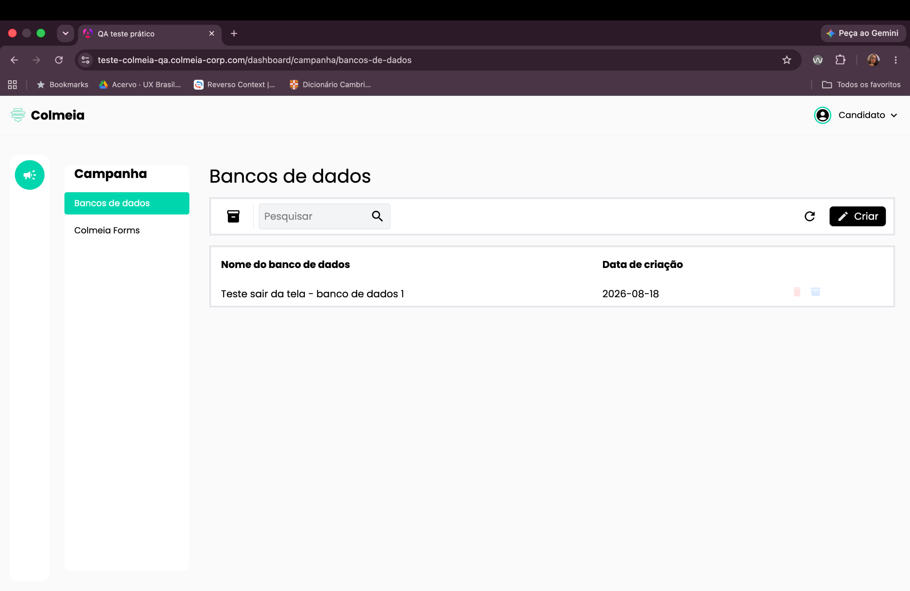
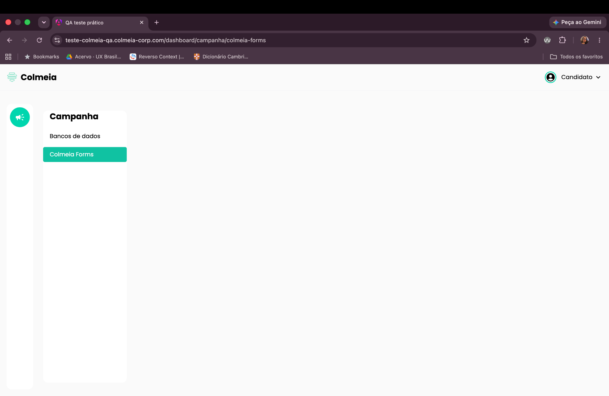
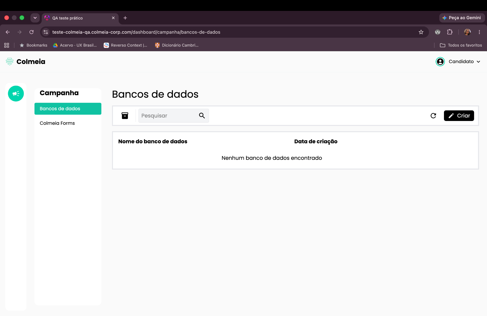

# BUG-005: Itens somem ao navegar entre telas (Banco de Dados ↔ Colmeia Forms)

**Severidade:** Alta
**Ambiente:** Navegador desktop, tela Banco de Dados

## Cenário
Validar a persistência dos itens ao alternar entre a tela de Banco de Dados e Colmeia Forms.

## Passos para reproduzir
1. Fazer login no sistema.
2. Na página inicial, clicar em **"Banco de Dados"** (com itens previamente cadastrados).
3. Clicar em **"Colmeia Forms"** e, em seguida, clicar novamente em **"Banco de Dados"**.

## Resultado observado
Os itens que estavam no banco de dados somem da tela após essa navegação.

## Resultado esperado
Ao retornar para a tela de Banco de Dados, os itens cadastrados devem permanecer visíveis.

## Evidências

