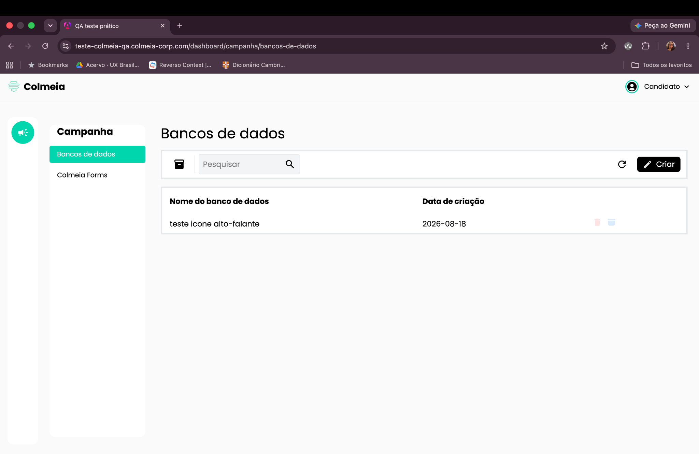
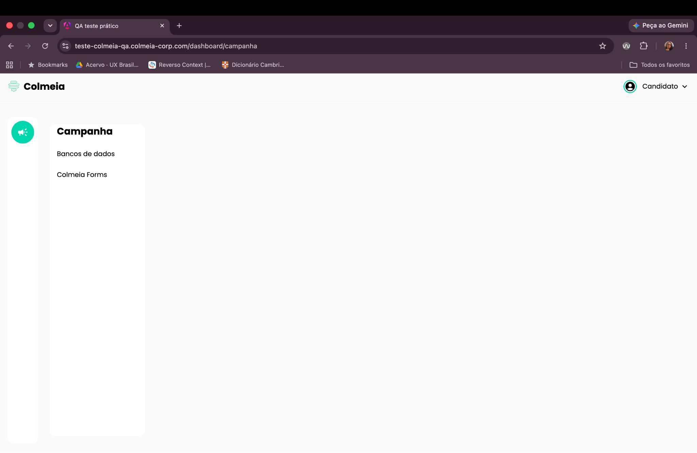
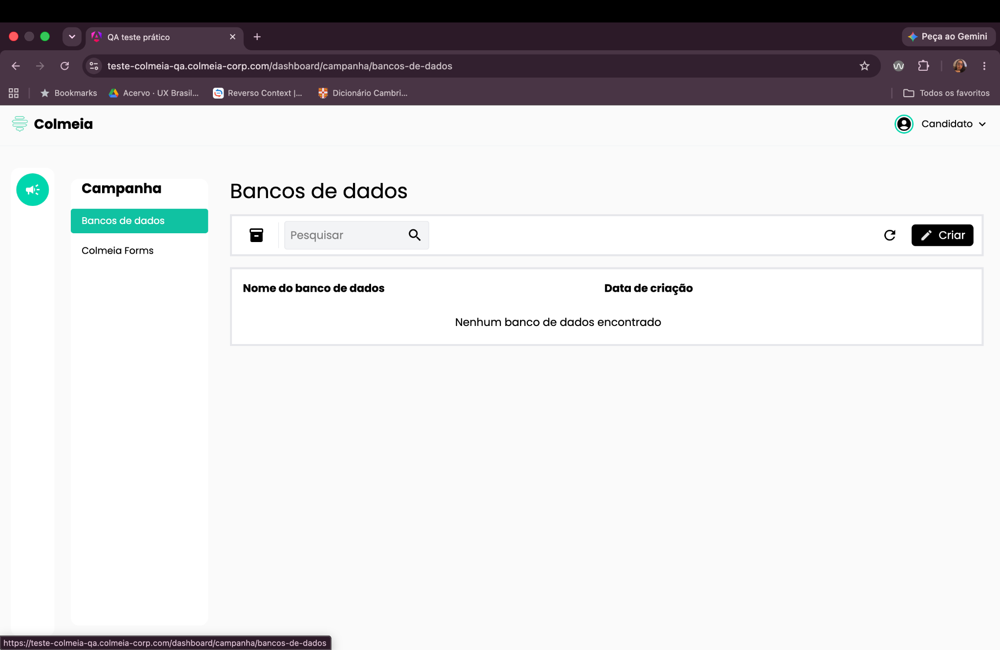

# BUG-006: Itens somem ao interagir com o ícone de alto-falante

**Severidade:** Alta
**Ambiente:** Navegador desktop, tela Banco de Dados

## Cenário
Validar o comportamento do Banco de Dados ao clicar no ícone de alto-falante.

## Passos para reproduzir
1. Fazer login no sistema.
2. Na página inicial, clicar em **"Banco de Dados"** (com itens previamente cadastrados).
3. Clicar no ícone de alto-falante e, em seguida, clicar novamente em **"Banco de Dados"**.

## Resultado observado
Os itens que estavam no banco de dados somem da tela após essa interação.

## Resultado esperado
Ao clicar no ícone de alto-falante e retornar à tela de Banco de Dados, os itens devem permanecer visíveis.

## Evidências

