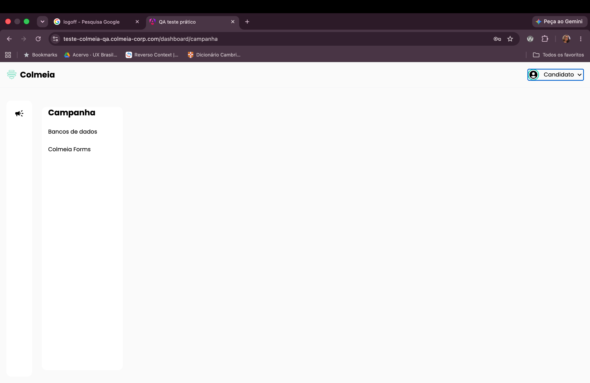

# BUG-007: Opção de logoff não disponível/responsiva no menu do candidato

**Severidade:** Média
**Ambiente:** Navegador desktop, tela inicial do sistema

## Cenário
Validar a funcionalidade de logoff a partir do menu do candidato.

## Passos para reproduzir
1. Na tela inicial do sistema, clicar no campo/menu **"Candidato"**.

## Resultado observado
Nenhuma ação ocorre ao clicar no campo; não há opção de logoff visível ou funcional.

## Resultado esperado
Ao clicar no campo "Candidato", a opção "Fazer logoff" deve estar visível e funcional.

## Evidências

