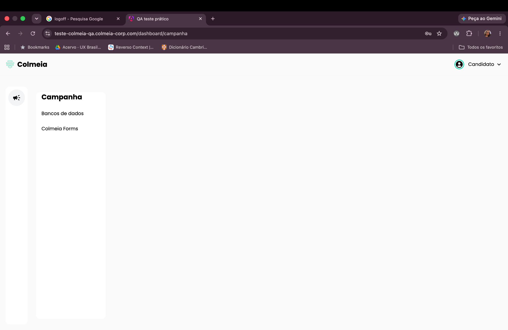
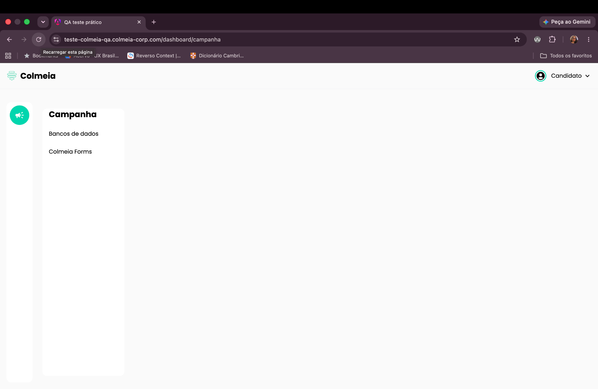

# BUG-008: Cor do ícone de alto-falante é perdida após novo login

**Severidade:** Baixa
**Ambiente:** Navegador desktop, sistema ColmeIA Forms

## Cenário
Validar a persistência visual (cor) do ícone de alto-falante entre sessões.

## Passos para reproduzir
1. Fazer login no sistema.
2. Sair do sistema (fechar sessão) e fazer login novamente.

## Resultado observado
O ícone de alto-falante, que estava verde antes de sair do sistema, aparece sem cor após o novo login. A cor original só retorna após recarregar a página do navegador.

## Resultado esperado
A cor do ícone de alto-falante não deve ser alterada ao sair e entrar novamente no sistema.

## Evidências

